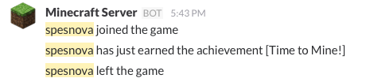

# Minecraft Notify [](https://quay.io/repository/spesnova/minecraft-notify)
A service(container) to notify Minecraft user events to Slack.



## SUPPORTED TAGS

- `latest`

## HOW TO USE
First, get your incoming webhook URL.
See: https://api.slack.com/incoming-webhooks

Second, configure your Slack setting in `.env`

```
SLACK_WEBHOOK_URL=https://hooks.slack.com/services/xxxx/xxxx/xxxxx
SLACK_CHANNEL=minecraft
SLACK_USERNAME=Minecraft Server
SLACK_ICON_EMOJI=minecraft
```

Then start notify service.

```
$ compose up -d notify
```

notify service gets Minecraft Server's log and extracts user events and posts it to Slack.
